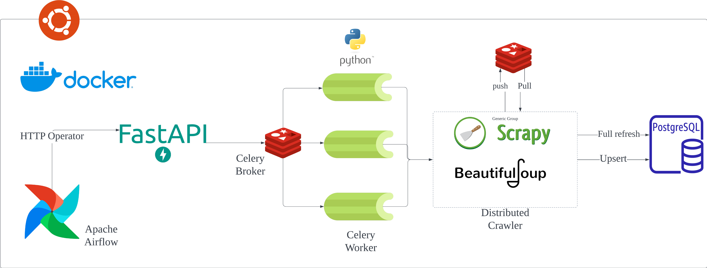

# 🚀 개요
- 백준 코딩테스트를 준비하는 사람들을 위해 문제 추천용 봇 서비스를 제공하기 위해 데이터 파이프라인를 구축했습니다. 
- Airflow, FastApi, Celery(Worker), Redis, Postgresql를 사용하여 데이터 수집용 파이프라인을 구성. 
- 이를 통해 모델링과 시각화를 통해 백준 인사이트를 제공할 수 있습니다.

# 📌 사용 데이터 
| 데이터 출처 | 데이터 분류  | 데이터 설명                              | 
|--------|---------|-------------------------------------|
 | 백준, Solved.ac   | 유저 데이터  | 백준과 Solved.ac API을 공통으로 이용하는 유저 데이터 |
| 백준, Solved.ac | 문제 데이터  | 백준과 Solved.ac API를 통해 수집하는 문제와 문제의 메타데이터 |            
| 백준 | 문제집 데이터 | 백준에서 삼성기출문제처럼 문제집과 문제의 ID를 담고 있는 정보 | 

# 🔗 데이터 파이프라인

# 📚 DB ERD

### Raw-Data ERD

